# Open Survey System (OSS)

**Open, affordable GNSS RTK platform** that enables centimeter‑level positioning (~10 mm XY / ~50 mm Z) using commodity, readily available modules. OSS aims to democratize survey‑grade measurements by publishing open hardware, firmware, and reference configurations.

> **Status:** early draft - architecture overview only. Detailed BOMs, Gerbers, STLs, and configuration guides will be added later.

---

## 1) System Overview

OSS consists of two building blocks:

1. **RTK Rover** - a portable GNSS receiver that works with common mobile apps (e.g., SW Maps, Locus GIS, QField, SurPad, LandStar etc.). The rover receives RTK corrections via NTRIP over the Internet **or** from a local Wi‑Fi NTRIP caster.
2. **Extension Kit (LoRa)** - a radio bridge that carries RTK corrections over longer distances using LoRa (433 MHz), (eg. when local access to RTK corrections over LTE is not available):
   - **LTE/LoRa Gateway** - fetches RTK corrections from an online NTRIP service (e.g., a national CORS) or from a local RTK base, then transmits them via LoRa.
   - **LoRa/Wi‑Fi Gateway** - receives LoRa packets with RTCM and exposes a local NTRIP caster over a Wi‑Fi Access Point.
   - **Local RTK Base Station** _(optional)_ - provides local corrections based on its precisely known position (surveyed once or derived from long averaging).

---

## 2) High‑Level Architectures (Topologies)

### A) Internet‑only (no radio) - rover is used in an area with internet access to RTK corrections (eg. by LTE)

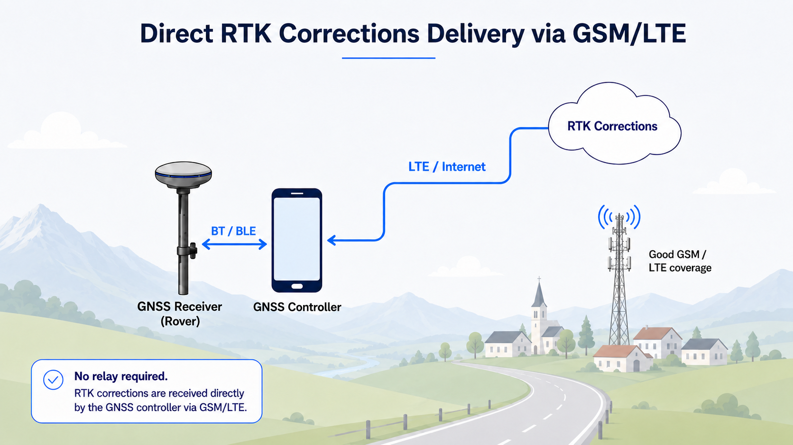

### B) Radio‑relayed corrections (LoRa 433 MHz) - radio relay deployed in an area without internet access to RTK corrections network; corrections are calculated locally

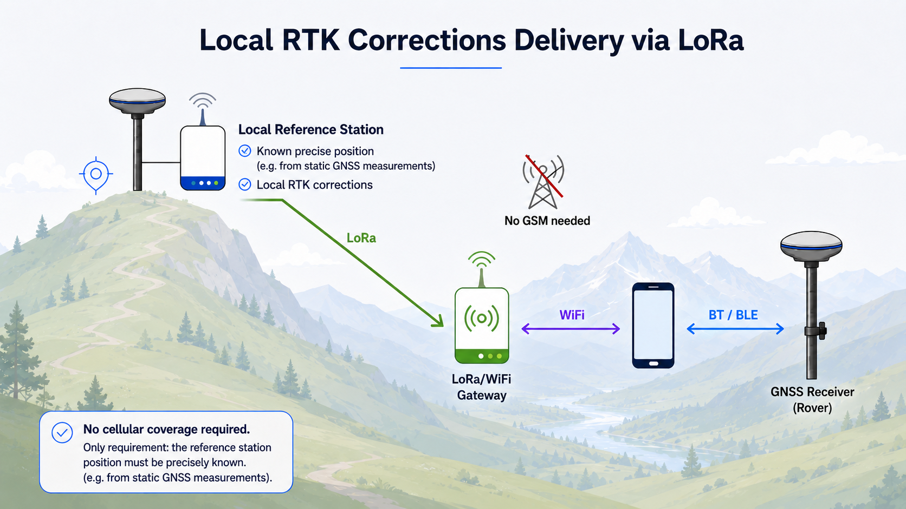

### C) Hybrid (online source → local radio) - radio relay deployed in an area with internet access to RTK corrections network (over LTE/Starlink, etc.)

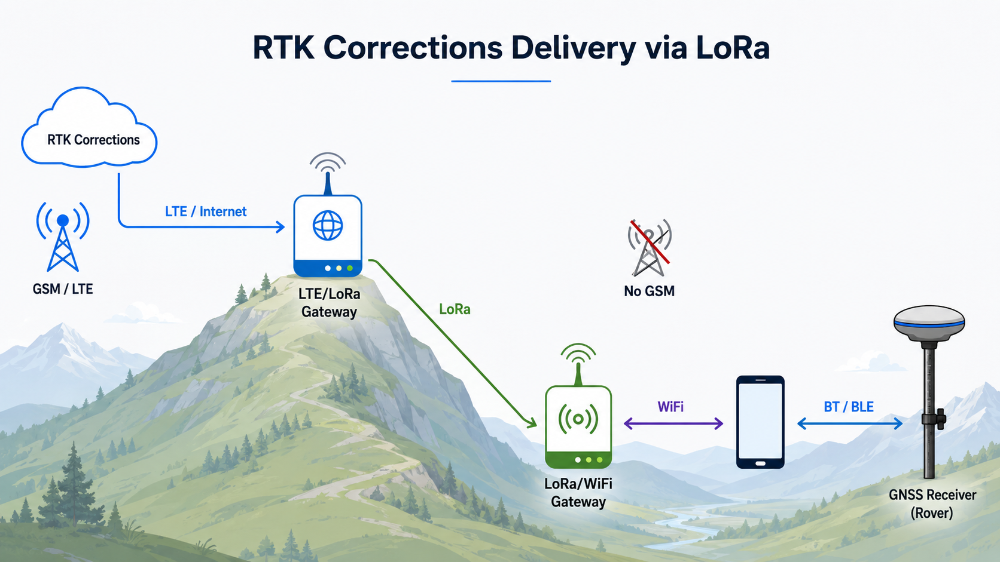

---

## 3) Component Roles

### RTK Rover

A compact, dual‑frequency GNSS RTK receiver that pairs with a mobile app. The app supplies RTK corrections (via Internet or a local NTRIP caster), while the rover provides position output to the app. Connectivity is kept simple (Bluetooth to the phone); no onboard Wi‑Fi or general‑purpose MCU is planned in the rover.

#### Enclosure

|                                    |                                    |
| ---------------------------------- | ---------------------------------- |
| 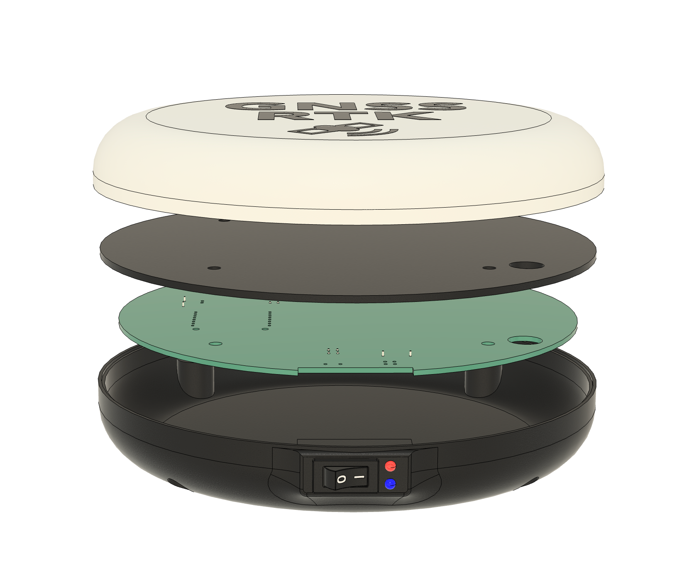 | 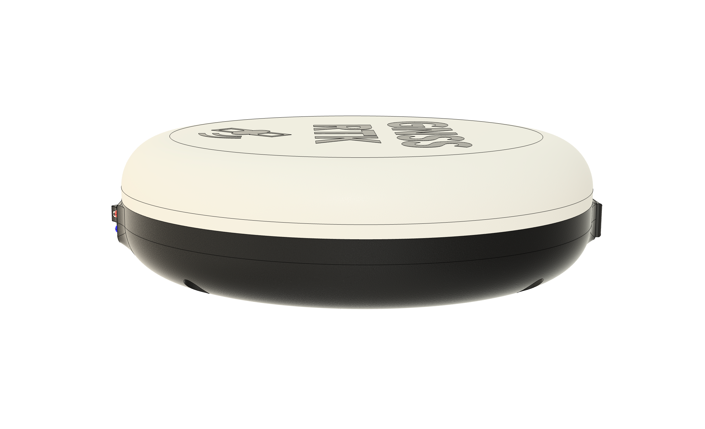 |
| 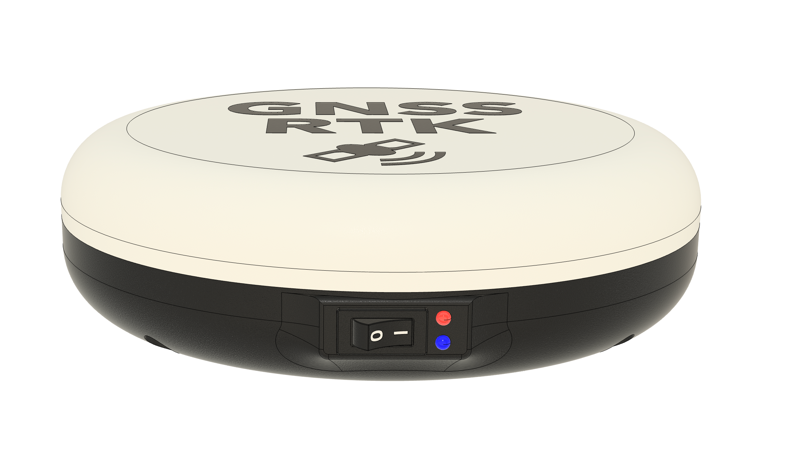 | 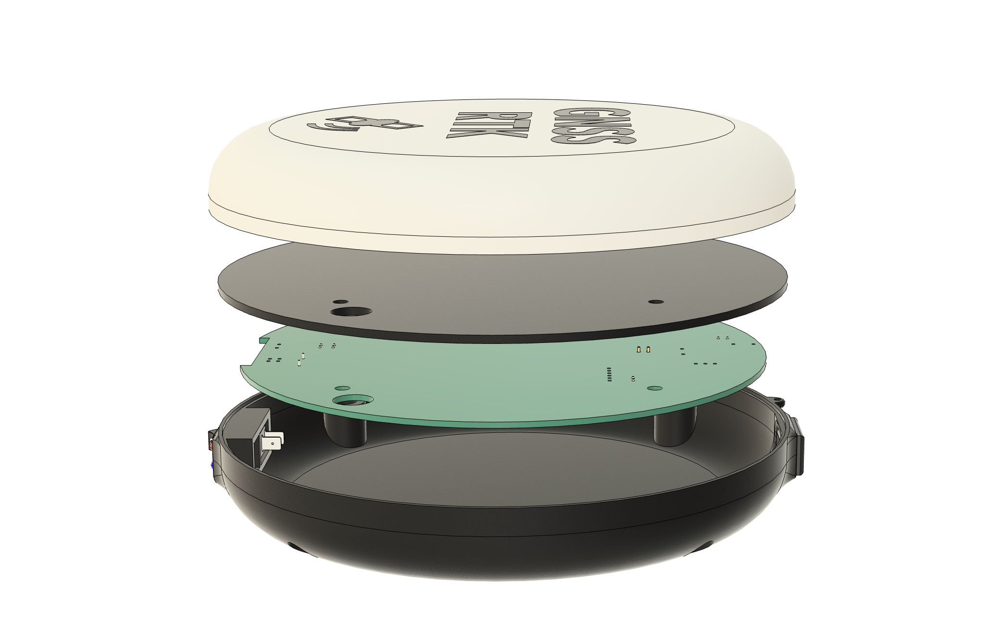 |

#### Inside

|                               |                               |
| ----------------------------- | ----------------------------- |
| 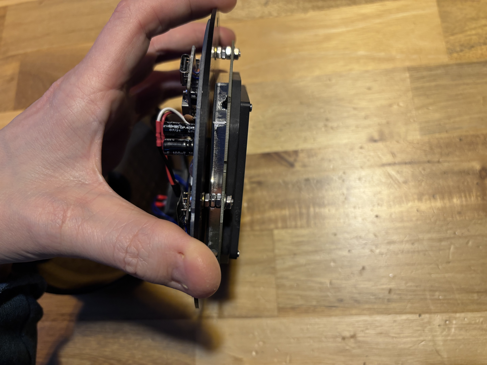 | 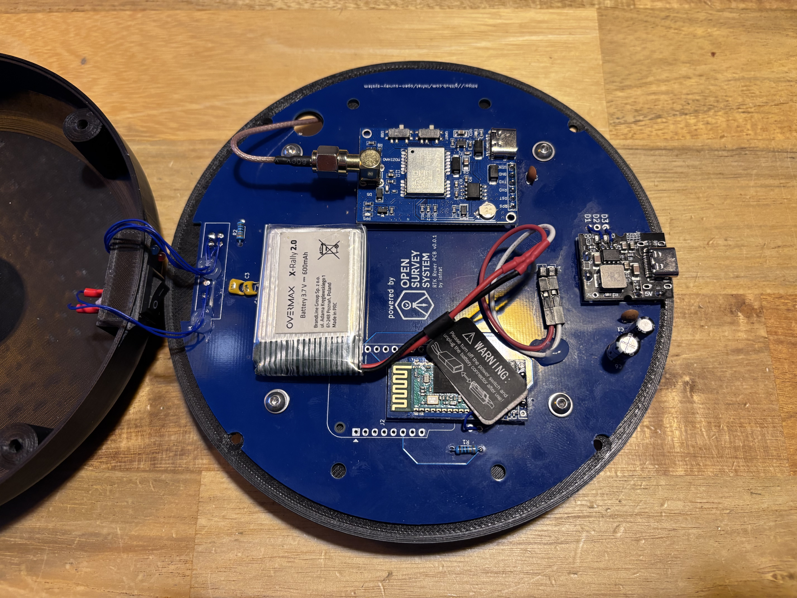 |

#### Outside

|                                 |                                 |
| ------------------------------- | ------------------------------- |
| 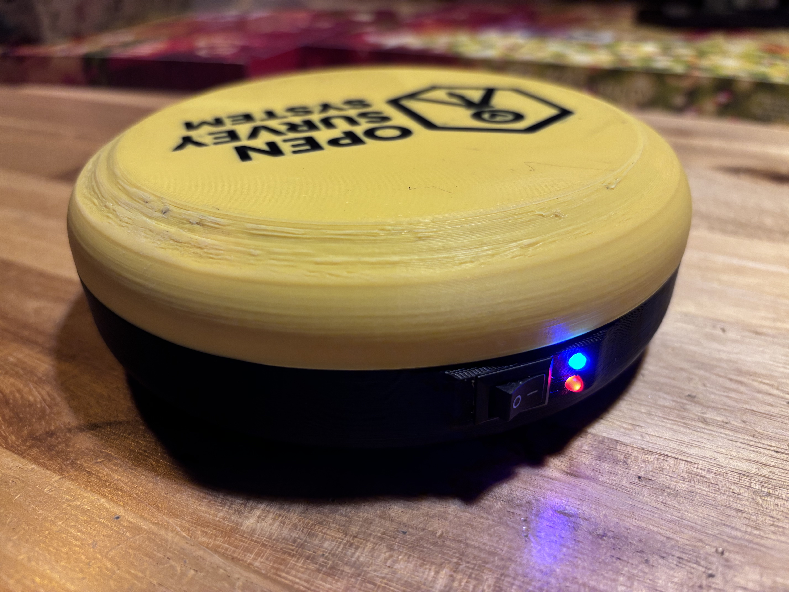 | 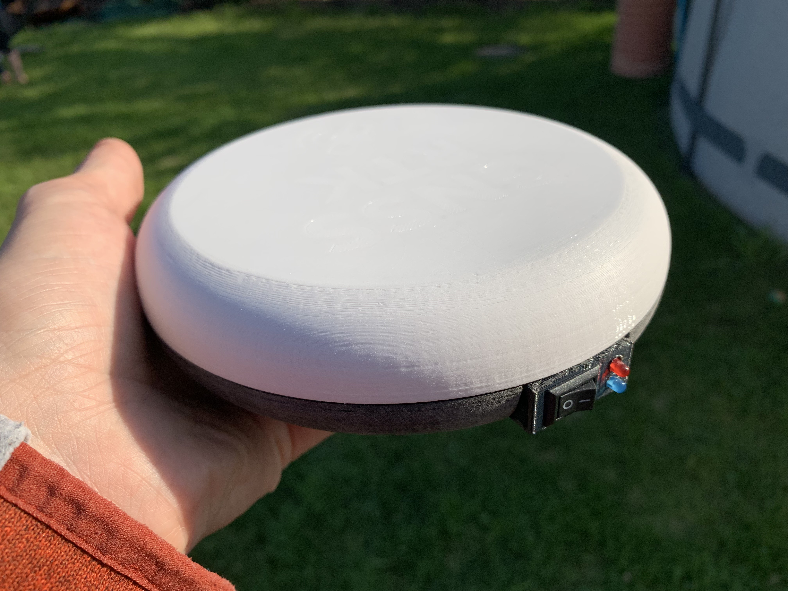 |

### LTE/LoRa Gateway (optional)

- Acts as an **NTRIP client** toward an online caster (e.g., CORS) **or** a local base station.
- **Encapsulates RTCM** and transmits over **LoRa 433 MHz (P2P)** to the LoRa/Wi‑Fi Gateway.

#### Photo

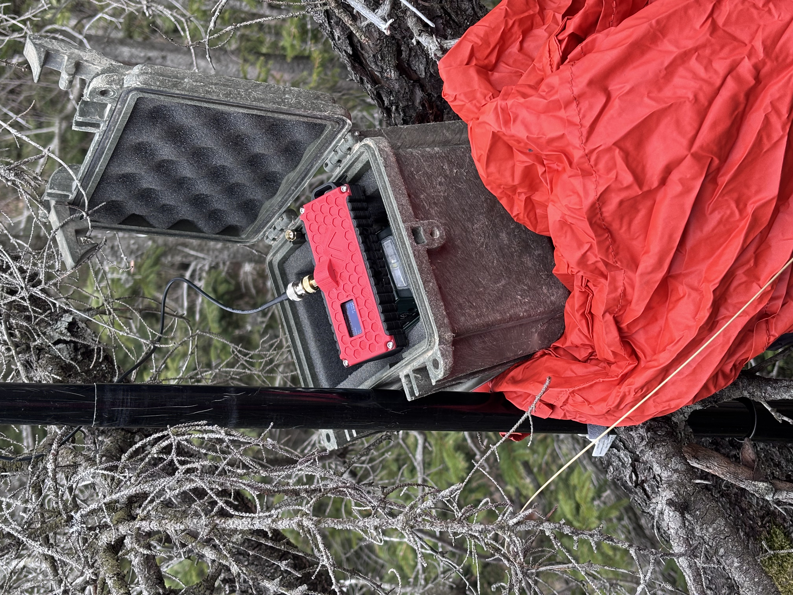

### LoRa/Wi‑Fi Gateway (optional)

- Receives **LoRa** packets and **reassembles RTCM** stream.
- Hosts a **local NTRIP caster** behind a Wi‑Fi **Access Point** for the rover/mobile app.

#### Photo

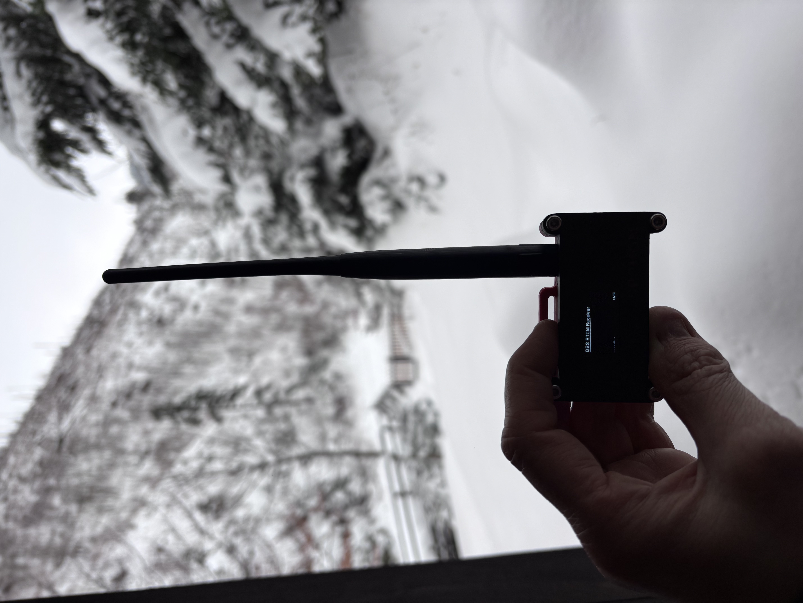

### Local RTK Base Station (optional)

- Provides **local RTCM** corrections from a fixed, accurately known position.
- Integrates with the LTE/LoRa Gateway to feed the radio uplink.

---

## 4) Data & Interfaces

- **Corrections:** RTCM 3.x over NTRIP (TCP/HTTP Basic).
- **Rover ↔ Phone link:** **Bluetooth SPP** (UART over BT using BT module, or BLE using ESP32).
- **Position output:** NMEA from rover to mobile apps.
- **Radio link:** LoRa 433 MHz, P2P mode (not LoRaWAN), optimized for low‑latency streaming.
- **Transport paths:**
  - Internet path: Mobile App (NTRIP client) → Online NTRIP Service → RTCM → **Bluetooth SPP** → Rover.
  - Radio path: Base or Online Service → LTE/LoRa Gateway → LoRa → LoRa/Wi‑Fi Gateway (NTRIP caster) → Mobile App → **Bluetooth SPP** → Rover.

---

## 5) Design Principles

- **Open & affordable:** publish hardware files (Gerbers), mechanical models (STL/STEP), firmware and configs.
- **Modular:** rover can operate standalone (Internet) or with the radio Extension Kit.
  > Extension Kit could be potentially used as a correction source to rovers from other manufacturers!
- **Interoperable:** works with mainstream mobile GIS apps.
- **Region‑aware:** radio operation must comply with local regulations (e.g., 433/869 MHz in EU).

---

## 6) Documentation

Component firmware and the shared, over-the-air specs are documented under `firmware/`:

### Shared specs (transmitter ↔ receiver)

The LoRa link is a contract between the two gateways, so its specs live in one canonical place — `firmware/shared/docs/` — and both firmwares must stay byte-compatible with them:

- [LoRa protocol](firmware/shared/docs/lora-protocol.md) - over-the-air packet format, fragmentation, radio parameters
- [Maintenance frame](firmware/shared/docs/maintenance-frame.md) - telemetry/maintenance and remote-command frames

### Transmitter (LTE/LoRa Gateway)

- [README](firmware/transmitter/README.md) - overview, hardware, quick start
- [Web UI config structure](firmware/transmitter/docs/config-structure.md) - configuration model and REST API
- [AGENTS.md](firmware/transmitter/AGENTS.md) - coding standards and workflow

### Receiver (LoRa/Wi‑Fi Gateway)

- [Architecture](firmware/receiver/docs/architecture.md) - task/core structure
- [Configuration](firmware/receiver/docs/configuration.md) - pins, timing, constants
- [NTRIP server](firmware/receiver/docs/ntrip-server.md) - local caster protocol flow
- [AGENTS.md](firmware/receiver/AGENTS.md) - coding standards and workflow

### Rover

- [README](firmware/rover/README.md) - overview and configuration

---

## 7) License

- Hardware: CERN OHL‑S v2 _(TBD)_
- Firmware/Software: Apache‑2.0 or MIT _(TBD)_
- Docs: CC‑BY‑4.0 _(TBD)_

---

### Notes

- Names and modules are placeholders for open, commonly available components.
- Rover = **GNSS RTK module + classic Bluetooth SPP module over UART**. Mobile app bridges NTRIP↔RTCM.
- This README intentionally omits implementation details; it is a high‑level map for the project structure and data flows.
