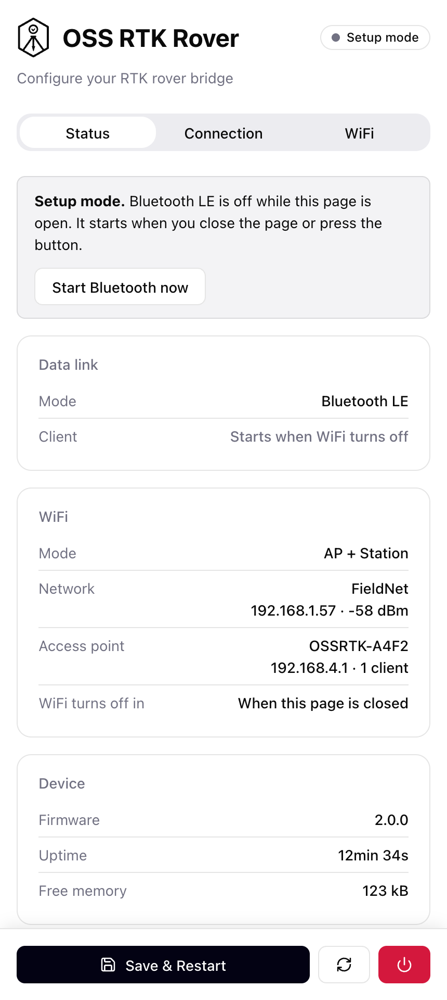
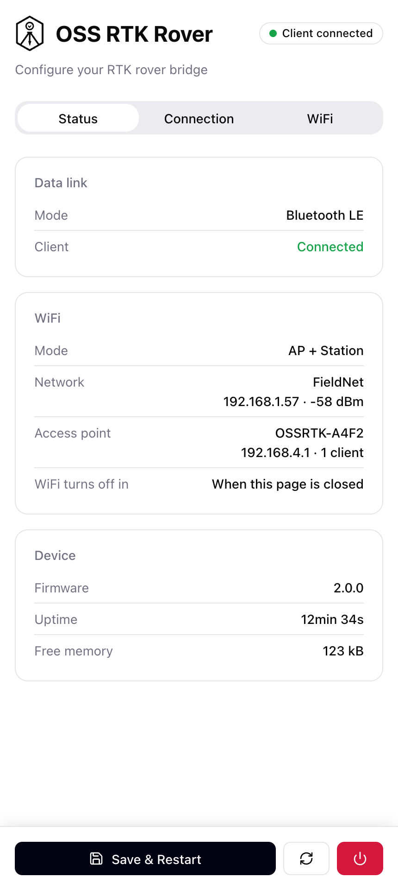
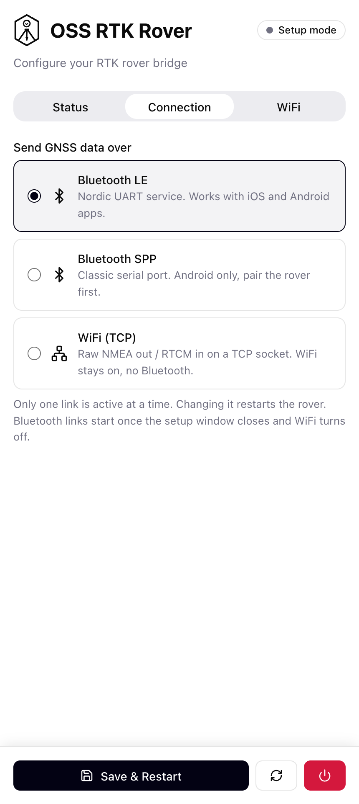
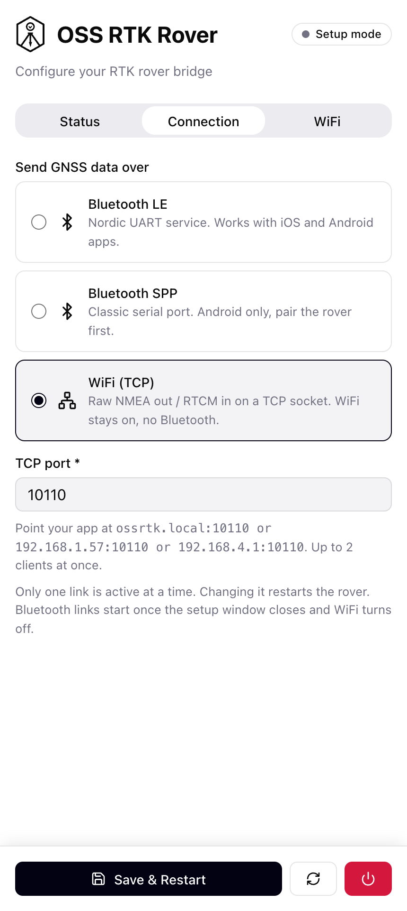
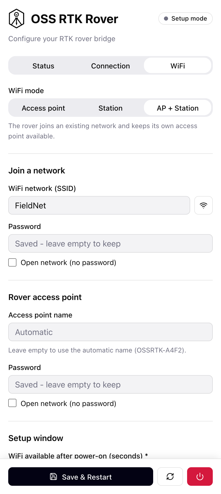
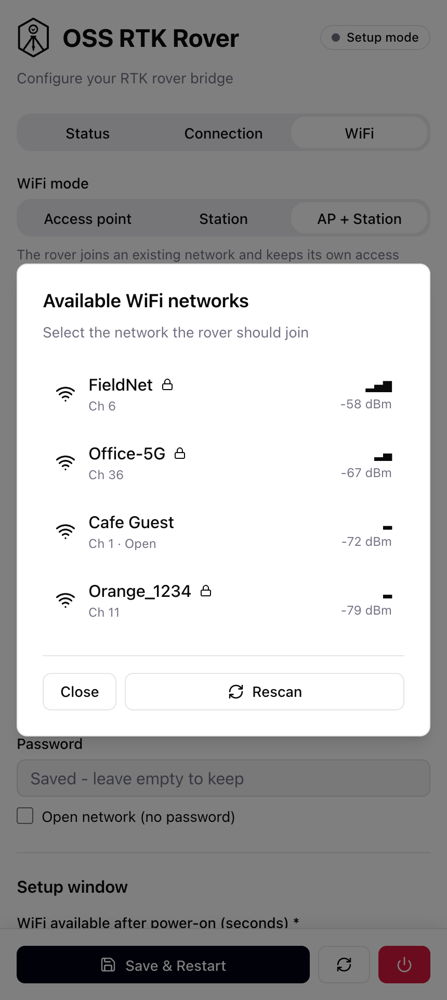

# Open Survey System (OSS) - RTK Rover Firmware

**ESP32 Firmware for GNSS RTK Rover**

This is the main ESP32 firmware for the **Open Survey System (OSS)** - an open-source GNSS RTK rover designed for professional surveying and mapping applications. The firmware bridges the GNSS RTK receiver's UART to iOS/Android devices over **BLE** (Nordic UART Service, default), **Bluetooth Classic SPP** (Android only) or a raw **WiFi TCP** socket. The link and the WiFi settings are chosen in a built-in **web UI** - see [Setup and Web UI](#setup-and-web-ui).

## Project Overview

The **Open Survey System RTK Rover** consists of three main components:

1. **GNSS RTK Receiver**: Quectel LC29H DA (dual-antenna, multi-band RTK)
2. **ESP32 MCU**: Main controller running this firmware (Wemos D1 Mini32)
3. **Power Management Module**: Battery management and power distribution

This firmware handles:

- ✅ Real-time NMEA/RTCM data streaming via BLE Nordic UART Service (NUS), Bluetooth Classic SPP or WiFi TCP
- ✅ Bidirectional communication (corrections from mobile → GNSS)
- ✅ Web UI for choosing the link and configuring WiFi (AP / Station / AP + Station)
- ✅ Over-The-Air (OTA) updates of firmware and web UI via WiFi
- ✅ Status LED indication

## Setup and Web UI

### How the rover starts

WiFi and Bluetooth share a single radio and most of the ESP32's memory, so the rover never runs them together:

1. **Power-on → setup window.** Only WiFi is up, with the web UI, OTA and Telnet. The LED gives a short flash once per second.
2. **Nobody opens the web UI within the window (30 s by default)** → WiFi switches off and the Bluetooth link starts. No restart needed.
3. **Someone is using the web UI** → the rover stays in setup mode. Close the page or press **Start Bluetooth now** to finish.

Only real use keeps WiFi on: an open and recently used web UI page, an OTA transfer or a Telnet session. A phone that merely joins the rover's WiFi does not. To get WiFi back, restart the rover.

With the **WiFi (TCP)** link there is no Bluetooth: WiFi stays on and the data link is available right after boot.

### Reaching the web UI

- On your network: `http://ossrtk.local` (or the rover's IP address)
- On the rover's own access point `OSSRTK-XXXX`: `http://192.168.4.1`

The UI has three tabs:

| Tab            | What it does                                                                                 |
| -------------- | -------------------------------------------------------------------------------------------- |
| **Status**     | Active link, client connection, WiFi addresses, time left in the setup window, firmware, heap |
| **Connection** | Choose Bluetooth LE, Bluetooth SPP or WiFi (TCP) and the TCP port                              |
| **WiFi**       | Access point / Station / AP + Station, network scan, credentials, setup window length          |

**Save & Restart** stores the settings in flash (NVS) and reboots the rover.

### Screenshots

The web UI is a single responsive page, designed for a phone screen.

**Status** - during the setup window (Bluetooth waits until the page is closed or **Start Bluetooth now** is pressed) and once a client has connected:

|                                                  |                                                                 |
| ------------------------------------------------ | --------------------------------------------------------------- |
|  |  |

**Connection** - choose the client link; the TCP port and the addresses to point your app at appear for the WiFi (TCP) link:

|                                                           |                                                                   |
| --------------------------------------------------------- | ----------------------------------------------------------------- |
|  |  |

**WiFi** - mode, network credentials, the rover's own access point and the setup window length; the scan button lists nearby networks:

|                                               |                                                     |
| --------------------------------------------- | --------------------------------------------------- |
|  |  |

### Client links

| Link                   | iOS | Android | Notes                                                        |
| ---------------------- | --- | ------- | ------------------------------------------------------------ |
| Bluetooth LE (default) | ✅  | ✅      | Nordic UART Service, 185B MTU                                |
| Bluetooth SPP          | ❌  | ✅      | Plain serial stream, pair with `OSSRTK` first                |
| WiFi (TCP)             | ✅  | ✅      | `ossrtk.local:10110` by default, up to 2 clients, WiFi stays on |

**⚠️ iOS cannot use SPP.** Bluetooth Classic SPP is not available to third-party iOS apps without MFi certification.

### WiFi modes

| Mode                   | Behavior                                                             |
| ---------------------- | -------------------------------------------------------------------- |
| Access point           | The rover creates its own network `OSSRTK-XXXX` (open unless you set a password) |
| Station                | The rover joins your network                                         |
| AP + Station (default) | Both at once                                                         |

If the rover cannot join the configured network within 10 seconds, it falls back to its own access point so the web UI stays reachable.

**⚠️ The web UI has no login and the default access point is open.** Set an access point password before using the rover around other people.

Adding a new link means implementing `ITransport` (see `src/transport.h`) and adding a branch to `src/transport_factory.cpp`.

## Hardware Components

## UART Pinout (ESP32 ↔ LC29H DA)

```
LC29H DA (GNSS)     ESP32 (Wemos D1 Mini32)
---------------     -----------------------
VCC_IN (3.3-5V) --> 3.3V (via power module)
GND             --> GND
UART1_TX        --> GPIO25 (RX - GNSS data to ESP32)
UART1_RX        <-- GPIO27 (TX - corrections to GNSS)
```

**UART Configuration:**

- Baud Rate: 115200
- Data: 8N1 (8 bits, no parity, 1 stop bit)
- Flow Control: None

## Power Saving

### WiFi setup window

- WiFi is only on during the setup window after power-on (30 s by default, 15-600 s in the web UI), then it is switched off
- With the WiFi (TCP) link WiFi stays on permanently and the rover draws correspondingly more

### Bluetooth low power mode

- TX Power: **-9dBm** (`BLE_TX_POWER` / `SPP_TX_POWER`)
- Range: ~10-15m (sufficient for rover-to-mobile)
- Bluetooth Classic (SPP) draws noticeably more than BLE

Current draw has not been re-measured for this firmware revision.

## Mobile App Compatibility

### Recommended iOS Apps (Bluetooth LE or WiFi TCP link)

1. **Lefebure NTRIP Client** - Professional RTK/NTRIP app
2. **SW Maps** - Survey and mapping with NTRIP support
3. **nRF Toolbox** (Nordic) - Testing NUS connection

### Android Apps (any link)

1. **Lefebure NTRIP Client**
2. **Mobile Topographer**
3. **Serial Bluetooth Terminal** - works with the SPP link (pair first) and with the BLE link in BLE mode

## Building and Uploading

Run the commands from the repository root. `oss-rover-usb` flashes over serial, `oss-rover` over WiFi - both build the same image.

### First Upload (via USB)

```bash
# Firmware
pio run -e oss-rover-usb -t upload

# Web UI files (LittleFS)
pio run -e oss-rover-usb -t uploadfs

# Monitor serial output
pio device monitor
```

A USB flash is also needed when upgrading from a firmware older than 2.0.0, because the partition table changed.

### OTA Updates (via WiFi)

```bash
pio run -e oss-rover -t upload      # firmware -> ossrtk.local
pio run -e oss-rover -t uploadfs    # web UI
# OTA password: admin (configurable in config.h)
```

**Important**: OTA only works during the setup window after power-on.

1. Restart the rover
2. Open `http://ossrtk.local` - an open web UI page keeps WiFi on
3. Run the upload
4. Close the page or press **Start Bluetooth now** when done

## Configuration

Day-to-day settings (client link, TCP port, WiFi mode and credentials, setup window length) are changed in the **web UI** and stored in flash. `include/config.h` holds the compile-time parameters and the factory defaults:

### UART Settings (GNSS)

```cpp
#define GPS_RX_PIN 25           // GNSS TX → ESP32 RX
#define GPS_TX_PIN 27           // ESP32 TX → GNSS RX
#define GPS_BAUD_RATE 115200    // LC29H DA baud rate
#define UART_BUF_SIZE 1024      // UART buffer (1KB)
```

### WiFi/OTA Settings (factory defaults)

```cpp
#define DEFAULT_TRANSPORT_MODE 0       // 0 = BLE, 1 = Bluetooth SPP, 2 = WiFi TCP
#define DEFAULT_WIFI_MODE 2            // 0 = AP, 1 = STA, 2 = AP+STA
#define DEFAULT_SETUP_WINDOW_SEC 30    // WiFi-only setup window after boot
#define WIFI_SSID "YourNetwork"        // default network to join
#define WIFI_PASSWORD "YourPassword"
#define OTA_HOSTNAME "ossrtk"          // ossrtk.local
#define OTA_PASSWORD "admin"
#define TCP_PORT_DEFAULT 10110         // NMEA-0183 over TCP
```

### Power Saving

```cpp
#define BLE_TX_POWER ESP_PWR_LVL_N9    // -9dBm (low power, BLE)
#define SPP_TX_POWER ESP_PWR_LVL_N9    // -9dBm (low power, SPP)
```

### Bluetooth Settings

```cpp
#define BT_DEVICE_NAME "OSSRTK"        // BLE scanner name / BT pairing name

// BLE link only:
#define BLE_MTU_SIZE 185               // iOS max MTU
#define BLE_CHUNK_SIZE 180             // Chunk size for large packets
```

### Status LED

```cpp
#define LINK_STATUS_LED_PIN 23         // GPIO23 (active HIGH)
#define LINK_LED_BLINK_MS 250          // Blink period when disconnected
```

## Nordic UART Service (NUS) UUIDs

The firmware implements the standard Nordic UART Service for maximum compatibility:

```
Service UUID:  6E400001-B5A3-F393-E0A9-E50E24DCCA9E
RX Char UUID:  6E400002-B5A3-F393-E0A9-E50E24DCCA9E  (Mobile → ESP32 → GNSS)
TX Char UUID:  6E400003-B5A3-F393-E0A9-E50E24DCCA9E  (GNSS → ESP32 → Mobile)
```

## Debugging and Monitoring

### Serial Monitor (USB - 115200 baud)

```
========================================
OSS RTK Rover 2.0.0
GPS (NMEA) ↔ UART bridge
========================================

[Setup] Transport: BLE, WiFi mode: sta, setup window: 30 s
[WiFi] Connecting to "YourNetwork"...
[WiFi] Setup window: off after 30 s without web UI / OTA / Telnet use
[Web] UI on port 80
[UART] Initialized GPS UART
[UART] RX: GPIO25, TX: GPIO27, Baud: 115200
[Setup] Setup window open: WiFi only, BLE starts when it closes
[OTA] Ready for firmware updates
[Telnet] Server started on port 23
...
[WiFi] Setup window closed - switching WiFi off
[Setup] Initializing BLE...
[BLE] Nordic UART Service started
[BLE] Device name: OSSRTK
Waiting for GPS data and client connection...
```

The same log is available over Telnet (`telnet ossrtk.local`) during the setup window.

**Data Flow:**

- **TX (ESP32 → Mobile)**: NMEA sentences, RTCM corrections status
- **RX (Mobile → ESP32)**: RTCM corrections from NTRIP caster

### Status LED Patterns

| Pattern                   | Status                                  |
| ------------------------- | --------------------------------------- |
| **Short flash every 1s**  | Setup window: WiFi only, link not started yet |
| **Blinking (250ms)**      | Waiting for a mobile connection         |
| **Solid ON**              | Mobile device connected                 |
| **Fast blinking (100ms)** | Error - UART init failed                |
| **Fast blinking (200ms)** | Error - transport (BLE/SPP) init failed |

## Troubleshooting

### No GNSS Data Received

**Check UART connection:**

```
LC29H DA TX (pin 5) → ESP32 GPIO25 (RX)
LC29H DA RX (pin 4) → ESP32 GPIO27 (TX)
```

**Verify in Serial Monitor:**

- Look for `[UART] Initialized GPS UART`
- Should see `[Bridge] UART → BLE: XX bytes` (or SPP/TCP) when GNSS is outputting data, once the link has started

**LC29H DA Configuration:**

- Default baud: 115200 (some modules ship at 9600 - check datasheet)
- Output rate: 1Hz or higher
- NMEA messages: GGA, RMC, GSA, GSV (minimum)

### Mobile App Can't Connect

**Wait for the setup window to end.** For the first 30 seconds after power-on (or as long as the web UI is open) only WiFi is running and the rover is not visible over Bluetooth. The LED switches from a short flash every second to an even blink when the link is up.

**Verify the link is running:**

- Bluetooth LE: serial log shows `[BLE] Nordic UART Service started`
- Bluetooth SPP: serial log shows `[SPP] Serial Port Profile server started`
- Device name: `OSSRTK`

**On mobile device (Bluetooth LE):**

1. Enable Bluetooth
2. Scan for `OSSRTK`
3. Connect (should see `[BLE] Device connected!` in logs)
4. LED should become solid ON

**On mobile device (Bluetooth SPP, Android):**

1. Pair with `OSSRTK` in the Android Bluetooth settings first
2. Open the serial port from the app (should see `[SPP] Client connected!` in logs)
3. LED should become solid ON

If an iPhone cannot see or connect to the rover, check which link is selected in the web UI - SPP is invisible to iOS apps.

**Use BLE Scanner app** to verify device is advertising with correct UUIDs

### No RTK Fix / Low Accuracy

**This is NOT a firmware issue** - check GNSS configuration:

- GNSS has clear sky view (no multipath/obstructions)
- RTCM corrections are being received (check mobile app)
- Corrections match GNSS constellation (GPS/GLO/GAL/BDS)
- Base station <40km away for RTK
- Wait 30-120s for RTK convergence

### Web UI Not Reachable

- WiFi is only on during the setup window. Restart the rover and open the page within 30 seconds.
- If the rover cannot join your network, it opens its own access point `OSSRTK-XXXX` after about 10 seconds; connect to it and open `http://192.168.4.1`.
- If the page shows "Web UI files not found", upload the filesystem: `pio run -e oss-rover-usb -t uploadfs`.

### OTA Update Failed

- Start the upload inside the setup window; the easiest way is to keep the web UI open while uploading.
- Check `ossrtk.local` is reachable: `ping ossrtk.local`
- Check the firewall isn't blocking mDNS/port 3232
- Use the IP address instead: `upload_port = 192.168.1.100`

## Example NMEA/RTCM Data

### NMEA Output (LC29H DA → Mobile)

```
$GNGGA,083559.00,5015.12345,N,01945.67890,E,4,24,0.6,123.4,M,45.2,M,1.2,0138*6F
$GNRMC,083559.00,A,5015.12345,N,01945.67890,E,0.012,,101224,,,D*7A
$GNGSA,A,3,01,03,06,09,14,17,19,22,,,,,1.2,0.6,1.0*3C
```

### RTCM Corrections (Mobile → LC29H DA)

```
Binary RTCM3 messages (e.g., 1005, 1077, 1087, 1097, 1127)
Sent from NTRIP caster via mobile app through BLE
```

## Project Structure

```
firmware/rover/
├── include/
│   └── config.h                 # Compile-time parameters and factory defaults
├── data/                        # Web UI (index.html, style.css, app.js) -> LittleFS
├── partitions.csv               # 2 x 1.81MB OTA slots + 256KB LittleFS
├── src/
│   ├── main.cpp                 # Setup + loop, setup window -> link hand-over
│   ├── settings.cpp/h           # Runtime settings, stored in NVS
│   ├── wifi_manager.cpp/h       # AP / STA / AP+STA, setup window
│   ├── web_server.cpp/h         # Web UI + REST API
│   ├── ota_service.cpp/h        # ArduinoOTA + mDNS
│   ├── telnet_service.cpp/h     # Remote log console
│   ├── logger.cpp/h             # Serial + Telnet logging
│   ├── system_control.cpp/h     # Deferred restart
│   ├── bridge.cpp/h             # GNSS UART <-> link, status LED
│   ├── uart_handler.cpp/h       # UART communication with LC29H DA
│   ├── transport.h              # ITransport interface
│   ├── transport_factory.cpp/h  # Creates the link selected in settings
│   ├── ble_uart_service.cpp/h   # BLE NUS (Bluedroid)
│   ├── spp_serial_service.cpp/h # Bluetooth Classic SPP (Bluedroid)
│   └── tcp_transport.cpp/h      # Raw TCP server
├── platformio.ini               # Standalone PlatformIO configuration
└── README.md                    # This file
```

## Dependencies

- **Platform**: Espressif32 (PlatformIO)
- **Framework**: Arduino
- **Libraries**:
  - `ESPAsyncWebServer` 3.7.10 + `AsyncTCP` 3.4.10 (ESP32Async) - web UI and REST API
  - `ArduinoJson` 6.21.6
  - Framework-bundled: BLE, BluetoothSerial (both Bluedroid), WiFi, LittleFS, Preferences, ESPmDNS, ArduinoOTA

## Technical Specifications

| Parameter           | Value                                         |
| ------------------- | --------------------------------------------- |
| **UART Speed**      | 115200 baud                                   |
| **Client link**     | BLE NUS (default), BT Classic SPP or WiFi TCP |
| **BLE Range**       | ~10-15m (-9dBm TX power)                      |
| **BLE MTU**         | 185 bytes (iOS max)                           |
| **Data Chunk Size** | 180 bytes (BLE packet); SPP/TCP unchunked     |
| **WiFi**            | Setup window after boot (default 30 s)        |
| **Flash Usage**     | ~1.76MB of a 1.81MB app slot (4MB flash)      |
| **Free heap**       | ~125KB in the setup window                    |

## Contributing

This is part of the **Open Survey System** project. Contributions welcome!

- Report issues on GitHub
- Submit pull requests for improvements
- Share your rover builds and field tests

## License

MIT License - Free for personal and commercial use

## Acknowledgments

- **Nordic Semiconductor** - Nordic UART Service specification
- **Espressif Systems** - ESP32 platform
- **Quectel** - LC29H DA GNSS module documentation
- **Open Survey System Community** - Testing and feedback
